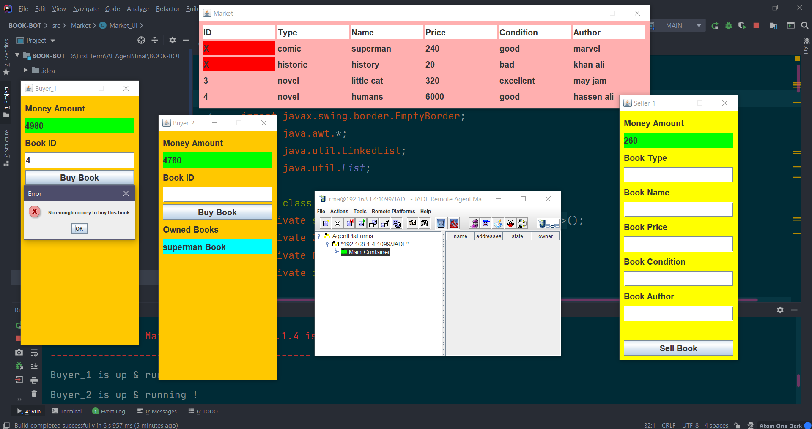

<h1 align="center">Book Bot</h1>
<h3>The project simulates a market where agents can buy and sell Books It is booktrading example using multiple buyer/seller agent's</h3>
<h3>Seller Agent can offer any book for sale after he identify book type, condition, name, author & price.</h3>
<h3>Buyer Agent can buy any book offered by the seller agent if he has enough money to buy it and he want to.</h3>
<h3>There is a simulation of the market/environment in this project with GUI.</h3>
<h1>Notes</h1>
<h3>Market GUI will be created automatically when create first agent</h3>
<h3>Buyer Agent -> ./src/BUY/Buyer_Agent.java</h3>
<h3>Seller Agent -> ./src/SELL/Seller_Agent.java</h3>
<h1>Screen shot 📷</h1>

